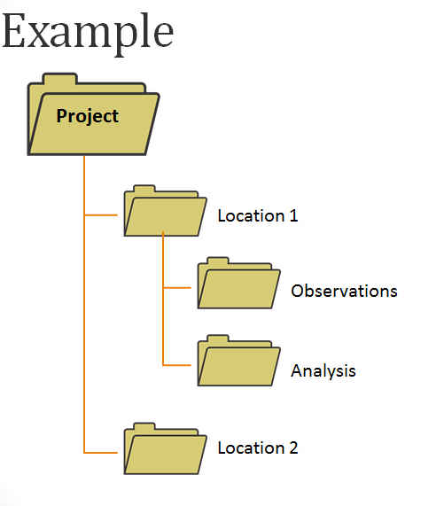
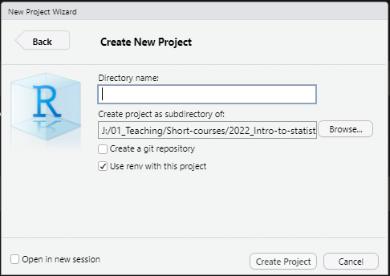

```{r setup-ch0, echo=FALSE, include=FALSE}
if (!require("rmdformats")) install.packages("rmdformats")
if (!require("pacman")) install.packages("pacman")
pacman::p_load(devtools)
if (!require("emo")) devtools::install_github("hadley/emo")
pacman::p_load(knitr,emo)
knitr::opts_chunk$set(echo = TRUE)
```

# Introducción  

**¡Bienvenido al Análisis de Supervivencia en EPCM usando R!**  

Esta libreta de ejercicios prácticos es parte del material **previo al curso**. 
Te guiará a través de los pasos de configuración necesarios para los componentes prácticos del taller.   

>En estos ejercicios instalarás **R** y **RStudio**. También aprenderás consejos generales sobre cómo **organizar** tus datos y archivos en preparación para los análisis de datos. Después de esto, recibiras una breve introducción a los **proyectos de R** y **scripts de R**. Finalmente, también aprenderás sobre **paquetes de R** y cómo instalarlos.  

***

# Instalar R y RStudio

## Permisos

Antes de la instalación, una nota de advertencia: debes instalar **R** y **RStudio** en un equipo en el que tengas permisos de lectura y escritura. Si no es así, tu capacidad para instalar **paquetes de R** (ver abajo) se verá afectada.  


## Instrucciones para usuarios de Windows

### Para instalar R

1. Ve a [CRAN](https://cran.r-project.org/bin/windows/base/)  
2. Haz clic en **Download R 4.5.1 for Windows** para descargar el ejecutable autoinstalable para instalar R (versión 4.5.1) desde CRAN como `R-4.5.1-win.exe`  
3. Ejecuta `R-4.5.1-win.exe` eligiendo todas las opciones predeterminadas en la instalación  
4. Ahora que **R** está instalado, necesitas descargar e instalar **RStudio**  

### Para instalar RStudio

1. Ve a [RStudio](https://posit.co/download/rstudio-desktop/) y haz clic en el botón **Download RStudio Desktop for Windows** (`RStudio-2025.05.1-513.exe`)   
2. Ejecuta `RStudio-2025.05.1-513.exe` y sigue las instrucciones de instalación  


## Instrucciones para usuarios de Mac

### Para instalar R

1. Ve a [CRAN](https://cran.rstudio.com/bin/macosx/)   
2. Descarga el primer enlace `.pkg` (`R-4.5.1-arm64.pkg`)  
3. Instala el paquete haciendo doble clic en él y siguiendo las indicaciones  
4. Ahora que **R** está instalado, necesitas descargar e instalar **RStudio**  

### Para instalar RStudio

1. Ve a [RStudio](https://www.rstudio.com/products/rstudio/download/)  
2. Haz clic en **macOS 13+**  (`RStudio-2024.05.1-513.dmg`)   
3. Guarda el archivo `.dmg` en tu computadora, haz doble clic para abrirlo, y luego arrástralo y suéltalo en tu carpeta de aplicaciones  

## RStudio

**RStudio** facilita el uso de **R** al producir una interfaz gráfica. Como se describe en [El Manual R del Epidemiólogo](https://epirhandbook.com/en/new_pages/basics.html#rstudio) 
"*Puedes pensar en R como el motor de un vehículo, haciendo el trabajo crucial,* 
*y RStudio como la carrocería del vehículo (con asientos, accesorios, etc.) que*
*te ayuda a usar realmente el motor para avanzar!*"  

**Abre RStudio** (asegúrate de que sea **RStudio** y no **R**):  

```{r fig.link="https://epirhandbook.com/en/images/RStudio_overview.PNG", out.width="100%", fig.align='center', echo=FALSE}
knitr::include_graphics("img/RStudio_overview.png")
```

**Haz clic** en la imagen para agrandar  

**RStudio** muestra cuatro mini-ventanas rectangulares, llamadas **paneles**.  

Descubrirás más sobre los paneles más adelante en esta página.  

***

# Organización de datos y archivos  

## Justificación  

**Organizar** datos y cualquier otro archivo requerido para tus análisis es el primer paso en cualquier proyecto de análisis de datos. Aprender cómo limpiar tus datos va más allá del alcance de este taller, pero vale la pena mencionar que tener un enfoque claro y sistemático para la limpieza de datos en general, y organizar archivos en particular, son sumamente importantes para la **reproducibilidad** y la **ciencia abierta (open science)**.

Una parte importante de organizar tu proyecto involucra cómo nombras tus archivos 
(datos, scripts, figuras, etc.) y cómo estructuras tus carpetas y subcarpetas
(también conocido como el **árbol de directorios**).  

### Cómo organizar mis archivos   
 
**¡La consistencia** y **lógica** son clave! Quieres asegurarte de que tus archivos estén organizados de tal manera que gastes poco o nada de tiempo encontrando archivos mientras trabajas. Esto a su vez facilitará un flujo de trabajo más rápido y con menos errores. Además, un árbol de directorios bien estructurado facilitará reproducir, reutilizar, o re-enfocar tu trabajo (para ti y para otros).  

```{r fig.link="https://libguides.princeton.edu/c.php?g=102546&p=930626", out.width="30%", fig.align='center', echo=FALSE}

```

**Por ejemplo:** todas mis carpetas `~/mi_proyecto/` tienden a tener mis scripts de R en la **carpeta raíz** (es decir, la carpeta donde están ubicados todos los archivos relevantes a un proyecto específico) y tienden a siempre tener las siguientes 3 subcarpetas:  

- `~/mi_proyecto/datos/`  
- `~/mi_proyecto/resultados/`  
- `~/mi_proyecto/manuscrito/`

### Cómo nombrar mis archivos

Una [nomenclatura clara](https://datamanagement.hms.harvard.edu/collect/file-naming-conventions) para nombres de archivos es esencial para evitar errores.

Los consejos generales para una nomenclatura clara incluyen lo siguiente:  

- **Sin espacios**: previene errores al importar archivos de datos o al obtener otros scripts (los espacios naturales entre palabras pueden ser reemplazados por `-` o `_`)  
- **Sin caracteres especiales**: también pueden causar errores (excepto `.`,`-` o `_` 
como arriba)    
- **Autodescriptivos**: de tal manera que sea fácil identificar qué contiene cada
archivo (¡o qué hace!)  
- **Incorporar lógica**: si hay un orden que los scripts o archivos siguen, es
buena práctica agregarlo al nombre   

**Por ejemplo**: considera un proyecto de investigación hipotético que analiza datos de una encuesta en la Ciudad de México que tuvo lugar en 2015.  

El siguiente **nombre de archivo** no usa convención de nomenclatura.    

`SCRIPT_FINAL__limpiar-encuesta Ciudad de Mexico 2015.R`  

Aunque describe lo que contiene, no necesariamente revela lo que hace. 
Además, como es difícil de escribir e incluye espacios, es **propenso a errores**.
De hecho, se ve peligrosamente similar a esto:  

```{r fig.link="https://xkcd.com/1459", out.width="25%", fig.align='center', echo=FALSE}
knitr::include_graphics("img/filenames.png")
```

Por otro lado, los siguientes scripts implementan los mismos análisis de datos
que el archivo de arriba, pero en un enfoque **paso a paso**. Además, los nombres de archivos describen el **orden** en que los scripts deben ejecutarse, lo cual es informativo para el desarrollador pero también para otros. Finalmente, el uso apropiado de caracteres especiales facilita la lectura mientras mantiene baja la probabilidad de errores.  

`01.1_combinar-datos-encuesta_CDMX-2015.R`    
`01.2_limpiar-datos-encuesta_CDMX-2015.R`     
`02.1_analisis-principales_CDMX-2015.R`    
`02.2_analisis-sensibilidad_CDMX-2015.R`    
`03.1_hacer-figuras_CDMX-2015.R`   
`03.2_hacer-tablas_CDMX-2015.R`    

> En resumen, considerar cuidadosamente cómo estructuras y nombras tus
archivos es una buena práctica para el análisis de datos.

***

## Proyectos de R   

Los Proyectos de R facilitan organizar los archivos de tu proyecto. Es buena idea desarrollar el hábito de usarlos desde temprano en tu camino de aprendizaje de R.  

Como se describe en el **Manual R del Epidemiólogo**, "[***Los proyectos de R***](https://epirhandbook.com/en/new_pages/r_projects.html)
*permiten que tu trabajo esté empaquetado en una carpeta portátil y autosuficiente.* 
*Dentro del proyecto, todos los scripts relevantes, archivos de datos, figuras/resultados,*
*e historial se almacenan en subcarpetas e importante - el* ***directorio de trabajo***
*es la carpeta raíz del proyecto.*"  

Puedes leer más sobre proyectos de R en [esta sección](https://r4ds.had.co.nz/workflow-projects.html) del
libro de texto **R para Ciencia de Datos** y en el [sitio web de RStudio](https://support.rstudio.com/hc/en-us/articles/200526207-Using-RStudio-Projects).   

### Crear un Proyecto de R

Desde **RStudio**

```{r out.width="100%", fig.align='center', echo=F}
# knitr::include_graphics("img/RStudio-1.png")
```

- Ve a **File** > **New Project**...  
- Selecciona **New Directory**  
- Luego, selecciona **New Project**  
- **Create New Project:**

```{r out.width="70%", fig.align='center', echo=F}

```

- Encuentra un directorio adecuado para crear tu proyecto   
- Por ejemplo, para este tutorial he creado una carpeta en la ruta `C:/ruta/al/directorio/2024_Analisis-supervivencia-en-EPCM`  
- Para este práctico, usa `taller` como **Directory name** (pero nota que el nombre podría ser cualquier cosa)
- Marca la casilla **Use renv with this project**  

Ahora tienes un proyecto de RStudio llamado **taller**. En segundo plano, RStudio creó para ti una carpeta llamada **taller** en el directorio que seleccionaste arriba (es decir `C:/ruta/al/archivo/2024_Analisis-supervivencia-en-EPCM`).  

También creó un archivo llamado `taller.Rproj` dentro de esta nueva carpeta (junto con otros archivos muy útiles de los que no necesitas preocuparte en este momento).  

***

## Scripts de R

Un script es un archivo basado en texto donde puedes recopilar las instrucciones
dadas a R para conducir tus análisis y producir tus resultados. Esto facilita
mantener un registro del trabajo hecho y te permite rehacer
análisis rápidamente. Importantemente, también ayuda a identificar errores y actuar sobre ellos.  

### Crear un script de R 

Ve a **File** > **New File** > **R Script**  

Un nuevo **panel** en el lado izquierdo de la ventana de **RStudio** debería aparecer automáticamente. Este se llama el **panel de código fuente**. La pestaña en la parte superior muestra el nombre del archivo, en este caso el Script de R que acabas de crear, que por defecto se llama **Untitled1**.  

El **panel de código fuente** es efectivamente un editor de texto básico donde puedes escribir tu código en uno (o múltiples) archivos de script.

Vamos a escribir una pequeña nota en nuestro script que nos dé una pista sobre de qué se trata este script.   

En el script **Untitled1** que acabas de crear, escribe:

``` {r}
# Material previo al curso
# Este es mi primer script de R
```

**CONSEJO**: El signo `#` se usa para *comentar* anotaciones.
Es buena práctica dejar notas para ti mismo (o para otros) sobre 
lo que hacen tus scripts.  

Ahora, guardemos el script:

- Ve a **File** > **Save As...**  (nota que RStudio automáticamente abre la carpeta recién creada `taller`)  
- Guarda este script como `00.practico-previo-al-curso.R`  

>***¡Listo!*** Ahora has creado un Proyecto de R llamado **taller**, que contiene un script de R llamado `00.practico-previo-al-curso.R`.  

***

## Configurar paquetes de R

### Qué es un paquete de R

R es genial por múltiples razones. Una de estas razones es su gran comunidad, que
está constantemente expandiendo las aplicaciones y herramientas disponibles para usuarios de R. Estas herramientas se llaman paquetes (`r emo::ji("package")`) y permiten a los usuarios *llamar* o utilizar nuevas funciones que luego se usan para tareas muy específicas (pero poderosas) durante el procesamiento y análisis de datos. En estos días, la mayoría de los programadores de R usan varios
paquetes para su trabajo.  

Puedes leer más sobre paquetes de R [aquí](https://epirhandbook.com/en/new_pages/basics.html#packages) en el 
**Manual R del Epidemiólogo**. Ahí, encontrarás una lista comprensiva de `r emo::ji("package")``r emo::ji("package")``r emo::ji("package")` que son útiles para el análisis de datos epidemiológicos. 
Este manual es también una gran fuente para el aprendizaje autodidacta de R para 
epidemiólogos de cualquier nivel de experiencia.    

### Instalar paquetes de R

Vamos a instalar una cantidad de paquetes que usaremos más adelante. Para
facilitar el proceso de instalación vamos a usar un paquete cuya función principal 
es ayudar a usuarios a instalar *otros* paquetes `r emo::ji("exploding head")`. 
Este paquete se llama `pacman` (sí, la gente de R se pone muy creativa al nombrar sus paquetes).  

Escribe en tu script de R lo siguiente (por favor siéntete libre de copiar-pegar, para evitar errores de escritura):

```{r eval=F, message=F}
if (!require("pacman")) install.packages("pacman")
```

Todo lo que esto hace es verificar si **pacman** ya está instalado. Si no, entonces lo instala.
(No te preocupes mucho por entender qué hace cada parte por ahora, 
las cosas tendrán más sentido conforme tu entendimiento de R aumente.)  

> ¡Ahora ejecútalo!

> `r emo::ji("face screaming in fear")``r emo::ji("face screaming in fear")`
`r emo::ji("face screaming in fear")` ***¡¿Cómo ejecuto algo en R?!*** 

Selecciona el texto que acabas de escribir en el script y ya sea:  

- Presiona `Ctrl`+`Enter`, o  
- Haz clic en **Run** en el encabezado del **panel de código fuente**  

Yo casi siempre prefiero la opción `Ctrl`+`Enter`.  

Notarás que aparece texto en el **panel** inferior izquierdo, en la pestaña **Console**
. La **consola** es donde R te dice qué está pasando. Ahí, encontrarás la "salida" or resultados de operaciones que has solicitado a R. Los mensajes de error también aparecen aquí. También puedes
usar R como una calculadora glorificada y escribir directamente en la **consola**. El resultado
de esos cálculos aparecerá ahí. Ten en cuenta que cualquier cosa que hagas (es decir, escribas) en la consola no se guardará en tu script de R.

En este caso particular, la consola debería indicarte que **pacman** ha
sido instalado exitosamente.  

Después de ser descargados e instalados, los paquetes necesitan ser cargados en cada sesión antes de que puedan ser usados para análisis. **pacman** ayuda con este proceso verificando si algún paquete en una lista dada está instalado o no (y si no está, entonces lo instala), y luego cargando tales paquetes.  

Ahora usaremos **pacman** para cargar los `r emo::ji("package")``r emo::ji("package")``r emo::ji("package")`
que usaremos para esta sesión.  

Ejecuta la siguiente línea:

```{r eval=F}
pacman::p_load(ggplot2) # El paquete "ggplot2" es una herramienta muy famosa usada para visualización en R
```

Usarás otros paquetes útiles durante los ejercicios prácticos. Sin embargo, 
una cosa a tener en cuenta es que solo necesitas *cargar* estos paquetes una vez
por sesión de R. Esto significa que no necesitas estar constantemente cargando paquetes cada
vez que quieras usarlos en tus scripts.  

Ahora que hemos instalado y cargado **ggplot2** con la ayuda de **pacman**
podemos probarlo. Copia y pega el siguiente código en tu script:

```{r eval=F}
ggplot(iris, aes(Sepal.Length)) +
  geom_histogram() +
  theme_classic()
```
Este código usa el conjunto de datos `iris` (pre-construido en R) para hacer un **histograma**
de la Longitud del Sépalo (ver descripción de `iris` [aquí](http://www.sthda.com/english/wiki/r-built-in-data-sets)).  

Ahora, ejecuta el código. Deberías ver lo siguiente:  

```{r echo=F}
pacman::p_load(ggplot2)
g <- ggplot(iris, aes(Sepal.Length)) +
  geom_histogram() +
  theme_classic()

g
```

Cargar y usar el paquete **ggplot2** te ha permitido hacer un histograma rápido.  

# Paquetes para el taller

Para estar completamente preparado para el taller, deberás instalar una cantidad de paquetes que necesitarás durante el taller.  

Usa el siguiente código:

```{r, eval=FALSE}
# Instalando paquetes necesarios para el taller
pacman::p_load(
  tidyverse,  # Una colección de paquetes de R para manipulación eficiente de datos, visualización y análisis usando principios de datos ordenados. 
  data.table, # Paquete de R rápido y eficiente en memoria para manipulación de datos.
  janitor,    # funciones simples para limpiar y organizar datos, especialmente para ordenar nombres de columnas desordenados y detectar duplicados.
  lubridate,  # simplifica el trabajo con datos de fecha y hora en R.
  Epi,        # Un paquete para análisis de datos epidemiológicos.
  survival,    # Proporciona herramientas para análisis de supervivencia, incluyendo funciones para ajustar y analizar modelos de supervivencia, tiempo hasta evento y riesgo.
  ggsurvfit   # Facilita la creación de figuras resumen de tiempo hasta evento (también conocido como supervivencia) con ggplot2. 
  ) 
```

# Terminando tu sesión de R

Para finalizar este práctico, vamos a repasar algunos pasos importantes.  

Es buena práctica guardar el progreso hecho en tu script. 

Ve a **File** > **Save**  

O alternativamente presiona `Ctrl` + `S`  

Cierra RStudio. Se te preguntará si quieres guardar tu **Espacio de trabajo**. Esto efectivamente significa que RStudio va a crear una imagen de tus variables actuales (incluyendo conjuntos de datos) y funciones, y guardarlas en un archivo llamado `.RData`. Cuando reabras RStudio más tarde, todo se verá como estaba cuando lo cerraste por última vez. Esta función puede parecer útil, especialmente cuando estás aprendiendo cómo usar R, pero es [ampliamente aconsejado **no hacerlo**](https://www.r-bloggers.com/2017/04/using-r-dont-save-your-workspace/). Esto podría llevar a malos hábitos como tener copias no registradas de datos a través de varios proyectos. También hace más fácil olvidar guardar tus scripts.  

Aunque todas las razones arriba podrían no tener mucho sentido ahora, lo harán más tarde. El mejor enfoque es siempre guardar tus scripts de R y tratar de recordar no depender de RStudio guardando el "workspace" o espacio de trabajo .

***

# Resumen

Para recapitular, en esta libreta de ejericios prácticos instalaste **R** y **Rstudio**. Luego creaste un **proyecto de R** donde puedes mantener archivos como scripts y datos. También creaste tu primer **script de R**, llamado `00.practico-previo-al-curso.R`. 

Luego instalaste el paquete **pacman** y después, usando este paquete, instalaste y *cargaste* el paquete **ggplot2**. Luego, probaste usar **ggplot2** para hacer un histograma.  

Finalmente, guardaste tu script, que actualmente se ve así:

```{r eval=F}
# Material previo al curso
# Este es mi primer script de R

if (!require("pacman")) install.packages("pacman")

pacman::p_load(ggplot2) # El paquete "ggplot2" es una herramienta muy famosa usada para visualización en R

ggplot(iris, aes(Sepal.Length)) +
  geom_histogram() +
  theme_classic()

# Instalando paquetes necesarios para el taller
pacman::p_load(
  tidyverse, # tidyverse es una colección de paquetes de R para manipulación eficiente de datos, visualización y análisis usando principios de datos ordenados. 
  data.table, # paquete de R rápido y eficiente en memoria para manipulación de datos
  janitor, # funciones simples para limpiar y organizar datos, especialmente para ordenar nombres de columnas desordenados y detectar duplicados.
  lubridate, # simplifica el trabajo con datos de fecha y hora en R
  Epi, # Un paquete para análisis de datos epidemiológicos
  survival # Proporciona herramientas para análisis de supervivencia, incluyendo funciones para ajustar y analizar modelos de supervivencia, tiempo hasta evento y riesgo
  ) 
```

antes de proceder a cerrar RStudio.

***

# Ve más allá

**Análisis de Supervivencia en EPCM usando R** es un taller diseñado para reforzar los principios de análisis de supervivencia usando R. **No** está diseñado para enseñarte cómo usar R.  

## Programación en R

Para aquellos que son nuevos en la programación en R (o en cualquier otro lenguaje) hay muchos recursos disponibles en línea que recomendamos usar para empezar:  

- **Mejor en general**: [El Manual R del Epidemiólogo](https://epirhandbook.com/index.html). Este es probablemente el curso más comprensivo para aquellos interesados en Epidemiología. Es útil tanto para novatos completos como para aquellos que ya usan otros lenguajes de programación o software de análisis estadístico (es decir, Stata, SPSS, o SAS).  
- **Bueno para programación**: [The Software Carpentry: Programming with R] (https://swcarpentry.github.io/r-novice-inflammation/)  
- **Bueno si está interesado en computación estadística**: [Statistical Computing at Johns Hopkins Bloomberg School of Public Health](https://lcolladotor.github.io/jhustatcomputing/)

## Principios de estadística

Para aquellos que están interesados en iniciarse en los **principios de estadística y análisis estadísticos**, les recomendamos el curso [Fundamendals of Statistical Software & Analysis](https://www.ndph.ox.ac.uk/study-with-us/fundamentals-of-statistical-software-analysis) desarrollado por el equipo de académicos docentes del [Nuffield Department of Population Health](https://www.ndph.ox.ac.uk/).

\newpage